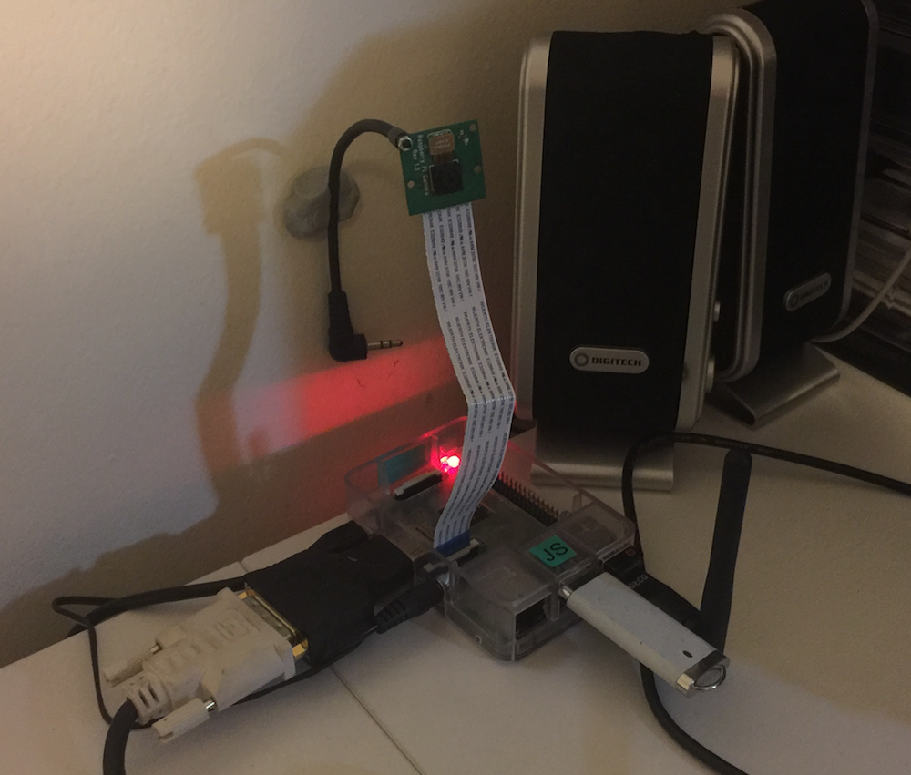

# Pidentity
Uses the Raspberry Pi 2 camera to detect motion and identify the person in view.

## Features

* Running average motion detection (to take changes in daylight into account)
* Searches and extracts faces using Haar Cascades (sped up with multiprocessing)
* Face training and recognition programs using machine learning
* Text-to-speech greeting when person is identified

## Workflow

There are 3 programs in

Program             |  Purpose
:-------------------------:|:-------------------------:
[acquire_faces.py](acquire_faces.py)  | Detects motion and then tries to use Haar Cascades to identify faces. If faces are found, they are then saved as .png files. You will want to run this program in many different lighting conditions and with the faces different distances from the camera so you can build a large training dataset which is representative.
[train_faces.py](train_faces.py)  | Uses the face training dataset to train a model to recognise different people.
[identify_faces.py](identify_faces.py) | Similar to the "acquire_faces.py" program, except that instead of saving the faces, the program will try to use the trained model to identify the face and speak to the person.

## Data

* The trained Haar Cascade face is in the "haar" directory
* Faces I have extracted and trained the program with are in "faces.tar.gz" and should be extracted before use. [To be added later]

## Requirements

* Python 2.7
* espeak
* OpenCV 2.4
* picamera
* NumPy
* scikit-learn
